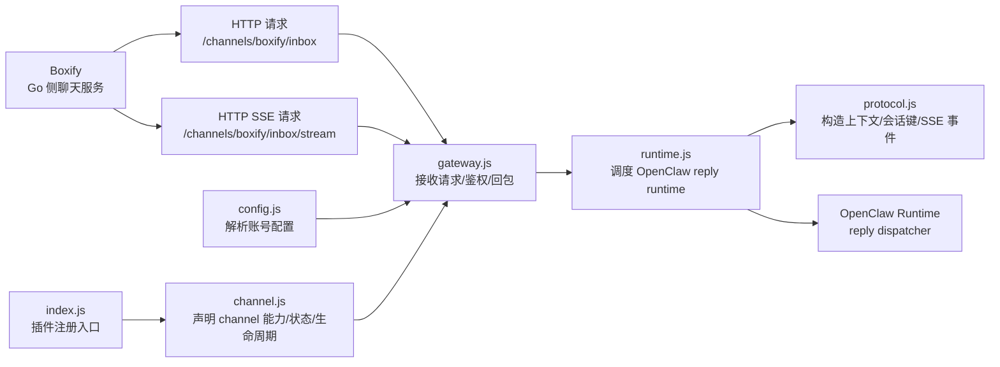
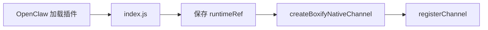
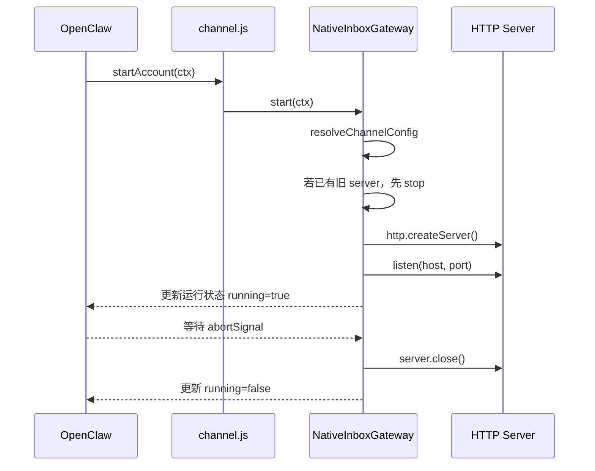
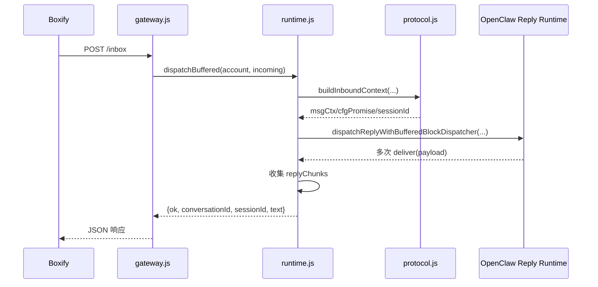
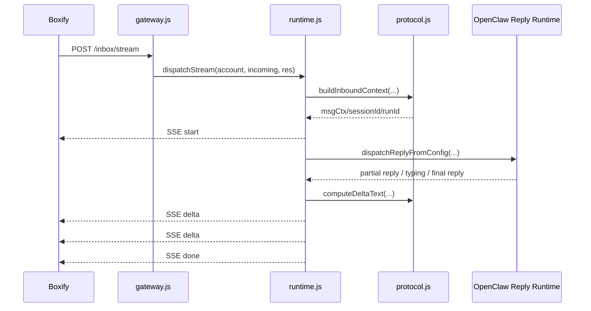
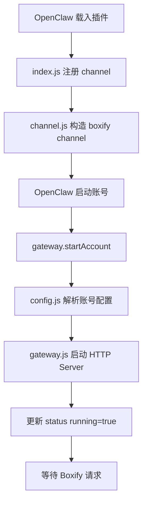
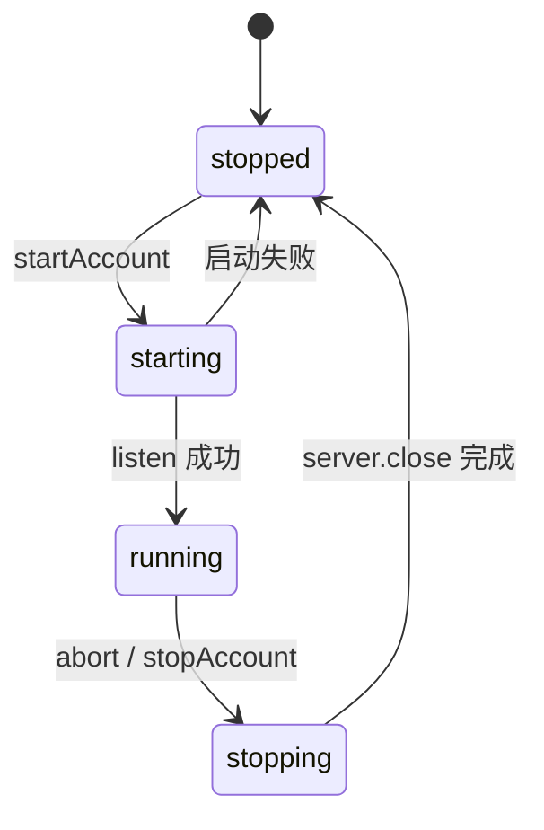

# Boxify Channel

`boxify` 是 Boxify 为 OpenClaw 提供的原生 `channel` 插件。

它的职责很明确：把 Boxify 侧发来的本地聊天请求，翻译成 OpenClaw reply runtime 能理解的上下文，然后把 OpenClaw 的回复结果再回传给 Boxify。

这一版已经不是早期的“命令桥接器”，而是标准 native channel 实现：

- 使用 `registerChannel`
- channel id 固定为 `boxify`
- 通过本地 HTTP inbox 接收请求
- 通过 OpenClaw 原生 reply runtime 执行回复
- 同时支持同步返回与 SSE 流式返回

---

## 1. 它解决了什么问题

如果没有这个插件，Boxify 想接入 OpenClaw，通常会遇到几个问题：

1. Boxify 不应该直接依赖 OpenClaw 内部 runtime 细节。
2. OpenClaw 需要的是“标准化 channel 上下文”，而 Boxify 发来的只是普通 HTTP 请求。
3. 聊天回复既可能是一次性结果，也可能是持续流式输出，两种模式都要统一封装。
4. 插件需要能被 OpenClaw 识别、配置、启动、停止，并暴露运行状态。

`boxify` 的价值，就是在这两套系统之间建立一层职责清晰的协议适配层。

---

## 2. 一眼看懂整体架构



可以把它理解成 5 层：

- `index.js`：插件注册入口
- `channel.js`：channel 描述与装配层
- `config.js`：配置归一化层
- `gateway.js`：HTTP 接入层
- `runtime.js` + `protocol.js`：协议翻译与执行层

---

## 3. 目录与模块总览

当前插件目录：

```text
plugins/experimental/boxify
├── index.js
├── channel.js
├── config.js
├── gateway.js
├── runtime.js
├── protocol.js
├── constants.js
├── package.json
└── openclaw.plugin.json
```

各模块职责如下：

| 模块 | 作用 | 设计重点 |
| --- | --- | --- |
| `index.js` | 插件入口，向 OpenClaw 注册 channel | 只做注册，不放业务逻辑 |
| `channel.js` | 组装 channel 定义、能力、配置、状态、gateway 生命周期 | 统一对接 OpenClaw 插件 SDK |
| `config.js` | 解析 `channels.boxify` 配置，兼容默认账号与多账号 | 把配置读取逻辑集中，避免散落 |
| `gateway.js` | 启动本地 HTTP server，接收 `/inbox` 和 `/inbox/stream` | 接入层只管请求，不掺杂 runtime 编排 |
| `runtime.js` | 调用 OpenClaw reply runtime，处理同步与流式回复 | 把“执行回复”与“监听端口”解耦 |
| `protocol.js` | 处理请求体解析、session key、上下文构造、SSE 格式、增量文本合并 | 协议细节集中管理 |
| `constants.js` | 放固定常量 | 避免字符串分散在多个文件 |
| `package.json` | OpenClaw 扩展元信息、安装信息 | 让插件可被识别与安装 |
| `openclaw.plugin.json` | 插件声明文件 | 声明插件 ID 和支持的 channels |

---

## 4. 模块逐个讲清楚

## 4.1 `index.js` 做什么

这是插件真正被 OpenClaw 加载时执行的入口。

核心动作只有两步：

1. 保存 `api.runtime`
2. 调用 `api.registerChannel(...)` 注册 `boxify` channel

它的设计很克制，不承担任何配置解析、HTTP 服务、协议翻译职责。这样做的原因是：

- 插件入口应该保持最薄
- 运行时引用 `runtimeRef` 可延后注入，避免模块初始化时过早绑定 runtime
- 真正的 channel 定义可以单独测试和演进

简化理解：



---

## 4.2 `channel.js` 做什么

这是整个插件的“总装层”。

它不直接处理请求，但它定义了这个 channel 在 OpenClaw 世界里的完整身份：

- `id/meta`
- `capabilities`
- `configSchema`
- `config` 解析逻辑
- `messaging` 目标格式
- `directory` 能力
- `status` 状态快照
- `gateway` 启停入口

### 它为什么是核心装配层

因为 OpenClaw 需要的不是一个简单函数，而是一整套 channel 契约。`channel.js` 的任务，就是把插件内部各个模块拼成一个符合契约的对象。

### 这里面最重要的几个部分

#### 1. `meta`

定义展示信息，比如：

- channel 名字
- docsPath
- 选择器标签

这是 OpenClaw UI 或管理侧识别这个 channel 的基础元数据。

#### 2. `capabilities`

当前声明：

- 只支持 `direct`
- 不支持 reactions / threads / media / nativeCommands
- 支持 `blockStreaming`

这意味着 Boxify Channel 当前定位是“本地对话型 channel”，不是一个完整 IM 平台适配器。

#### 3. `config`

把账号配置能力挂给 OpenClaw：

- 如何列出账号
- 如何解析账号
- 默认账号是谁
- 账号是否已配置
- 账号是否启用

这一层的真正实现都在 `config.js`，但 `channel.js` 负责把它们接到 SDK 需要的位置。

#### 4. `status`

OpenClaw 需要知道：

- 当前有没有跑起来
- 最近一次启动时间
- 最近一次停止时间
- 最近错误是什么

这些状态不是业务状态，而是“运行状态”。`channel.js` 负责定义快照结构，`gateway.js` 在运行过程中填充数据。

#### 5. `gateway`

这里把 `startAccount` / `stopAccount` 暴露给 OpenClaw。

实际启动和停止 HTTP 服务的逻辑都在 `NativeInboxGateway`，但 OpenClaw 只认识 channel 暴露出来的接口，所以这一层负责桥接。

---

## 4.3 `config.js` 做什么

`config.js` 是配置归一化模块。

它解决的问题不是“有没有配置”，而是“无论配置写成什么样，插件内部都拿到统一结构”。

### 它主要处理三件事

#### 1. 账号 ID 归一化

`normalizeAccountId(accountId)`

作用：

- 去掉空白
- 空值时回落到 `DEFAULT_ACCOUNT_ID`

意义：

- 避免默认账号在各处被写成 `""`、`undefined`、`null`
- 统一“默认账号”的判断语义

#### 2. 监听地址归一化

`normalizeListenURL(listenURL)`

作用：

- 若未填写，则回退到 `http://127.0.0.1:32124`
- 自动去掉末尾 `/`

意义：

- 避免后续拼接 `/channels/boxify/inbox` 时产生双斜杠
- 保证所有模块看到的是同一格式的 base URL

#### 3. 单账号 / 多账号配置合并

`resolveChannelConfig(cfg, accountId)`

它支持两种结构：

```json
{
  "channels": {
    "boxify": {
      "listenUrl": "http://127.0.0.1:32124",
      "sharedToken": "token",
      "defaultAgent": "main"
    }
  }
}
```

也支持：

```json
{
  "channels": {
    "boxify": {
      "listenUrl": "http://127.0.0.1:32124",
      "sharedToken": "root-token",
      "accounts": {
        "dev": {
          "listenUrl": "http://127.0.0.1:32125",
          "defaultAgent": "dev-agent"
        }
      }
    }
  }
}
```

设计原则是：

- 根配置提供默认值
- `accounts.<id>` 提供覆盖项
- 内部始终输出统一结构：`{ accountId, name, enabled, listenUrl, sharedToken, defaultAgent, configured }`

### 为什么一定要单独抽出 `config.js`

因为配置逻辑是最容易在多个地方重复实现的：

- 启动 gateway 要解析一次
- 状态展示要解析一次
- 账号列表要解析一次

如果不集中，后面很容易出现“运行时看到一个值，状态页看到另一个值”的漂移问题。

---

## 4.4 `gateway.js` 做什么

`gateway.js` 是 HTTP 接入层，真正负责“监听端口并接请求”。

它的主类是 `NativeInboxGateway`。

### 它管理什么

- 每个账号对应的 HTTP server 生命周期
- 请求方法与路径检查
- token 校验
- 请求体读取
- 把请求转交给 runtime
- 返回 JSON 或 SSE

### 它不管理什么

- 不负责构造 OpenClaw message context
- 不负责生成 session key
- 不负责决定回复怎么流式切片
- 不负责解析复杂业务配置

这就是典型的“网关层只做接入”的设计。

### 启动过程

`start(ctx)` 的核心流程如下：



### 请求入口

它只接受两个路径：

- `/channels/boxify/inbox`
- `/channels/boxify/inbox/stream`

并且都要求：

- `POST`
- 如果配置了 `sharedToken`，请求头必须带 `x-boxify-token`

### 两类请求是如何分发的

#### 普通同步请求

路径：

`/channels/boxify/inbox`

流程：

1. 读取 JSON body
2. 调用 `runtime.dispatchBuffered(...)`
3. 返回 JSON

#### SSE 流式请求

路径：

`/channels/boxify/inbox/stream`

流程：

1. 读取 JSON body
2. 设置 `text/event-stream`
3. 调用 `runtime.dispatchStream(...)`
4. 逐条写出 `start/delta/done/error` 事件

### 为什么 `gateway.js` 要维护 `activeServers`

因为这是多账号场景下的必要状态：

- 每个账号可能监听不同端口
- 插件 reload 时需要精准关闭旧实例
- 避免同一账号重复启动多个 server

所以它用 `Map<accountId, server>` 做运行时实例表。

---

## 4.5 `runtime.js` 做什么

`runtime.js` 是插件里最关键的执行层。

它的职责不是“接收 HTTP”，而是“把 Boxify 请求翻译成 OpenClaw reply runtime 的一次执行”。

主类：`BoxifyChannelRuntime`

包含两个核心方法：

- `dispatchBuffered(account, incoming)`
- `dispatchStream(account, incoming, res)`

---

### 4.5.1 `dispatchBuffered` 如何工作

这是同步模式。

它依赖 OpenClaw 提供的：

- `dispatchReplyWithBufferedBlockDispatcher`

执行过程：



### 它的设计特点

#### 1. 先构造标准上下文，再执行

这让 runtime 不需要关心 HTTP 层细节，也不用直接解析原始 body 字段。

#### 2. 通过 `deliver` 收集块

OpenClaw 可能分块返回内容，插件把每段文本收集进 `replyChunks`，最后用 `\n\n` 合并成最终文本。

#### 3. 把错误压平为统一响应结构

无论是上下文构造失败、config 加载失败、reply runtime 执行失败，最终都返回：

```json
{
  "ok": false,
  "conversationId": "...",
  "sessionId": "...",
  "error": "..."
}
```

这样 Boxify 侧不需要理解 OpenClaw 内部错误类型。

---

### 4.5.2 `dispatchStream` 如何工作

这是流式模式。

它依赖 OpenClaw 提供的能力：

- `createReplyDispatcherWithTyping`
- `dispatchReplyFromConfig`
- `withReplyDispatcher`

### 流式模式的设计目标

1. 尽量实时把回复推给 Boxify
2. 避免重复发送累计文本
3. 最终仍然能收敛出完整文本

### 流式时序图



### 为什么要有 `computeDeltaText`

很多 reply runtime 在流式回调里给出的不是“真正增量”，而是“累计文本快照”。

例如：

1. 第一次回调：`你好`
2. 第二次回调：`你好，我是`
3. 第三次回调：`你好，我是 Boxify`

如果直接转发，前端会收到三段重复内容。

所以 `runtime.js` 会结合 `protocol.js` 里的 `computeDeltaText(current, next)`，把累计文本转成真正新增的片段：

| 当前文本 | 新文本 | 发出的 delta |
| --- | --- | --- |
| `""` | `你好` | `你好` |
| `你好` | `你好，我是` | `，我是` |
| `你好，我是` | `你好，我是 Boxify` | ` Boxify` |

### 它如何避免重复片段

`dispatchStream` 里还有一个 `lastPartial`：

- 如果新的 partial 文本和上一次一样，直接跳过
- 避免某些 runtime 重复回调导致前端重复渲染

### SSE 事件模型

当前流式接口会发送以下事件：

| 事件名 | 含义 | 典型字段 |
| --- | --- | --- |
| `start` | 一次回复开始 | `conversationId`, `sessionId`, `runId` |
| `delta` | 一段新增文本 | `text` |
| `done` | 回复结束 | `text` 为完整收敛文本 |
| `error` | 执行失败 | `error` |

---

## 4.6 `protocol.js` 做什么

如果说 `runtime.js` 是执行层，那么 `protocol.js` 就是“协议工具箱”。

它把最容易散掉的底层细节集中起来。

### 主要能力

#### 1. `readJSONBody(req)`

读取 HTTP body 并解析 JSON。

为什么单独抽出：

- `gateway.js` 不应该堆很多底层 I/O 代码
- 请求体解析出错时可以统一处理

#### 2. `waitForAbort(signal)`

让 gateway 在启动后阻塞，直到 OpenClaw 发出终止信号。

意义：

- channel 生命周期由 OpenClaw 管
- gateway 不需要自己发明一套“常驻循环”

#### 3. `writeSSE(res, event, data)`

把数据按标准 SSE 格式写回：

```text
event: delta
data: {"text":"你好"}
```

这样流式协议格式就不会散落在 runtime 里。

#### 4. `computeDeltaText(currentText, nextText)`

用于把累计文本规整为增量片段。

这是流式模式最关键的协议工具之一。

#### 5. `toSessionId` / `toSessionKey`

它们负责把 Boxify 的 `conversationId` 变成 OpenClaw 可稳定识别的 session key。

生成规则大意：

```text
agent:<agentId>:boxify_session_<conversationSuffix>
```

例如：

```text
agent:main:boxify_session_123
```

这样设计的价值在于：

- 同一 conversation 能稳定命中同一 session
- 不同 agent 会自然隔离上下文
- 会话键格式与 OpenClaw native channel 习惯一致

#### 6. `buildInboundContext(runtime, account, incoming)`

这是最核心的方法。

它把 Boxify 的入站请求翻译为 OpenClaw reply runtime 需要的消息上下文。

它会处理：

- `conversationId`
- `messageId`
- `runId`
- `text`
- `agentId`
- `senderId`
- `chatType`
- `metadata`
- `sessionId`

然后调用：

- `runtime.channel.reply.finalizeInboundContext(...)`

生成标准 `msgCtx`。

### 为什么这个函数这么重要

因为 Boxify 发来的只是业务语义：

```json
{
  "conversationId": "conv_123",
  "text": "你好"
}
```

而 OpenClaw 需要的是偏 channel/runtime 语义的上下文：

- `Body`
- `RawBody`
- `From`
- `To`
- `SessionKey`
- `OriginatingChannel`
- `ChatType`
- `SenderName`
- `Timestamp`

`buildInboundContext` 就是这两种语义之间的翻译器。

---

## 4.7 `constants.js` 做什么

这个文件很小，但作用很实际。

它集中放了几个不会频繁变化的常量：

- `CHANNEL_ID = "boxify"`
- `PLUGIN_ID = "boxify"`
- `NATIVE_INBOX_PATH = "/channels/boxify/inbox"`
- `NATIVE_STREAM_INBOX_PATH = "/channels/boxify/inbox/stream"`
- `DEFAULT_LISTEN_URL = "http://127.0.0.1:32124"`

好处很直接：

- 避免多个模块复制字符串
- 减少改路径时漏改
- 提高协议常量的一致性

---

## 4.8 `package.json` 与 `openclaw.plugin.json` 做什么

这两个文件不参与请求处理，但决定了插件能不能被 OpenClaw 正确识别。

### `package.json`

这里声明：

- 插件名称与版本
- `type: module`
- 入口 `main: index.js`
- OpenClaw 扩展元信息
- 安装方式
- `peerDependencies.openclaw`

尤其重要的是 `openclaw.channel` 字段，它让 OpenClaw 知道：

- 这是一个 channel 插件
- channel id 是 `boxify`
- 展示名称是什么

### `openclaw.plugin.json`

它负责提供更直接的插件声明：

- 插件 id：`boxify`
- 支持的 channels：`["boxify"]`

可以理解成：

- `package.json` 偏 Node 包与扩展元数据
- `openclaw.plugin.json` 偏插件声明清单

---

## 5. 插件到底是怎么运转的

下面分别用“启动流程”“同步请求流程”“流式请求流程”讲清楚。

## 5.1 启动流程



启动阶段的关键点：

- 不是插件一加载就立刻开始监听
- 而是由 OpenClaw 生命周期驱动 `startAccount`
- `gateway.js` 启动后会阻塞等待 `abortSignal`
- 收到停止信号后才关闭 server 并更新状态

---

## 5.2 一次同步请求如何流转

### Boxify 发起请求

```http
POST /channels/boxify/inbox
Content-Type: application/json
x-boxify-token: your-token
```

请求体示例：

```json
{
  "conversationId": "conv_123",
  "messageId": "msg_456",
  "agentId": "main",
  "text": "你好",
  "metadata": {
    "source": "boxify",
    "senderName": "Alice"
  }
}
```

### 插件内部发生的事

1. `gateway.js` 检查路径、方法、token
2. `protocol.js.readJSONBody` 读取请求体
3. `runtime.js.dispatchBuffered` 开始一次同步执行
4. `protocol.js.buildInboundContext` 构造 OpenClaw 上下文
5. OpenClaw reply runtime 执行回复
6. `runtime.js` 收集块并合并成最终文本
7. `gateway.js` 返回 JSON

### 成功响应示例

```json
{
  "ok": true,
  "conversationId": "conv_123",
  "sessionId": "agent:main:boxify_session_123",
  "text": "你好，我是 OpenClaw。"
}
```

### 失败响应示例

```json
{
  "ok": false,
  "conversationId": "conv_123",
  "sessionId": "agent:main:boxify_session_123",
  "error": "OpenClaw 执行失败",
  "text": ""
}
```

---

## 5.3 一次流式请求如何流转

### 请求入口

```http
POST /channels/boxify/inbox/stream
Content-Type: application/json
Accept: text/event-stream
```

### 插件内部流转

1. `gateway.js` 识别到 `/stream`
2. 设置 `Content-Type: text/event-stream`
3. `runtime.js.dispatchStream` 创建 reply dispatcher
4. OpenClaw 持续产生 partial/final reply
5. `protocol.js.computeDeltaText` 计算真正增量
6. `protocol.js.writeSSE` 逐条写出事件
7. 完成后发出 `done`

### SSE 示例

```text
event: start
data: {"eventType":"start","conversationId":"conv_123","sessionId":"agent:main:boxify_session_123","runId":"run_1"}

event: delta
data: {"eventType":"delta","conversationId":"conv_123","sessionId":"agent:main:boxify_session_123","runId":"run_1","text":"你好"}

event: delta
data: {"eventType":"delta","conversationId":"conv_123","sessionId":"agent:main:boxify_session_123","runId":"run_1","text":"，我是 Boxify"}

event: done
data: {"eventType":"done","conversationId":"conv_123","sessionId":"agent:main:boxify_session_123","runId":"run_1","text":"你好，我是 Boxify"}
```

---

## 6. 配置如何设计

最小配置：

```json
{
  "channels": {
    "boxify": {
      "enabled": true,
      "listenUrl": "http://127.0.0.1:32124",
      "sharedToken": "your-token",
      "defaultAgent": "main"
    }
  }
}
```

字段说明：

| 字段 | 作用 | 说明 |
| --- | --- | --- |
| `enabled` | 是否启用账号 | 为 `false` 时不启动监听服务 |
| `name` | 账号名称 | 用于展示 |
| `listenUrl` | 插件监听基地址 | 实际路径会自动拼接 `/channels/boxify/inbox` |
| `sharedToken` | 共享令牌 | 若非空，请求头必须携带 `x-boxify-token` |
| `defaultAgent` | 默认 agent | 入站请求未显式传 `agentId` 时使用 |
| `accounts` | 多账号覆盖 | 按账号 ID 做局部覆盖 |

### 多账号示例

```json
{
  "channels": {
    "boxify": {
      "listenUrl": "http://127.0.0.1:32124",
      "sharedToken": "root-token",
      "defaultAgent": "main",
      "accounts": {
        "dev": {
          "listenUrl": "http://127.0.0.1:32125",
          "sharedToken": "dev-token",
          "defaultAgent": "dev"
        },
        "test": {
          "listenUrl": "http://127.0.0.1:32126",
          "enabled": false
        }
      }
    }
  }
}
```

设计思路：

- 根节点作为公共默认值
- 子账号只写差异项
- 启动时按账号解析成完整配置对象

---

## 7. 请求协议如何设计

## 7.1 入站请求格式

请求体字段：

| 字段 | 必填 | 作用 |
| --- | --- | --- |
| `conversationId` | 是 | Boxify 侧对话 ID，也是 session 映射基础 |
| `text` | 是 | 用户输入文本 |
| `messageId` | 否 | 当前消息 ID |
| `runId` | 否 | 当前一次运行的标识，流式场景常用 |
| `agentId` | 否 | 指定使用哪个 agent |
| `senderId` | 否 | 发送者 ID |
| `chatType` | 否 | 当前只区分 `direct/group` |
| `metadata` | 否 | 扩展信息，会透传进上下文 |

最小请求：

```json
{
  "conversationId": "conv_123",
  "text": "帮我解释一下这段 SQL"
}
```

### 为什么 `conversationId` 和 `text` 是硬性必填

因为：

- 没有 `conversationId` 就无法稳定映射 session
- 没有 `text` 就无法构造有效的入站消息体

所以 `buildInboundContext` 会直接校验这两个字段。

---

## 7.2 Session 设计

session key 的生成格式：

```text
agent:<agentId>:boxify_session_<conversationSuffix>
```

设计目标：

1. 同一对话多次请求落到同一 session
2. 不同 agent 天然隔离
3. 非法字符要清洗，避免 session key 不安全

这也是为什么 `protocol.js` 里要先做 `toSessionId()` 再做 `toSessionKey()`。

---

## 7.3 元数据设计

`metadata` 会挂入 `finalizeInboundContext`，用于补充：

- `senderName`
- `conversationLabel`
- 其他上层业务字段

这个设计让插件能保持通用，不需要为了每个新字段都改固定协议。

---

## 8. 状态与生命周期如何运转

插件运行状态主要由 `gateway.js` 维护，通过 `ctx.setStatus(...)` 回写给 OpenClaw。

当前关注的状态字段有：

- `running`
- `lastStartAt`
- `lastStopAt`
- `lastError`

### 生命周期图



### 为什么状态层单独重要

因为这不是普通脚本，而是被 OpenClaw 托管的 channel：

- UI 可能需要展示“是否在线”
- reload 时要知道是否成功重启
- 出错时要能从 `lastError` 快速定位

---

## 9. 这个插件的设计原则

整个实现最重要的不是“代码量少”，而是职责边界清晰。

## 9.1 接入层与执行层分离

- `gateway.js` 只管接入 HTTP
- `runtime.js` 只管调度 OpenClaw runtime

这样以后无论是把 HTTP 换成 `registerHttpRoute`，还是改成其他传输方式，都不需要重写执行逻辑。

## 9.2 配置层集中

- 所有配置解析统一经过 `config.js`

这样避免多账号逻辑在多个模块里各写一遍。

## 9.3 协议细节集中

- 会话键
- SSE 格式
- 上下文映射
- 增量文本计算

都集中在 `protocol.js`，避免关键协议规则四处分散。

## 9.4 兼容同步和流式两种交付模型

同步适合简单调用；
流式适合需要前端即时展示打字效果的场景。

二者共享同一套入站上下文模型，只在交付方式上分叉。

---

## 10. 安装与使用

安装：

```bash
openclaw plugins install /Users/sheepzhao/WorkSpace/Boxify/plugins/experimental/boxify
```

安装后，OpenClaw 会读取：

- `package.json`
- `openclaw.plugin.json`
- `index.js`

然后将 `boxify` 识别为一个可用 native channel。

---

## 11. 与 Boxify Go 侧的关系

这个插件本身只负责 OpenClaw 侧的 channel 适配。

而在 Boxify 应用内部，通常还会有一层 Go 侧聊天服务去做：

- 组织请求
- 调用本地 inbox
- 消费 SSE
- 保存消息与会话
- 把流式结果回推给前端

也就是说：

- `boxify` 负责“接 OpenClaw”
- Boxify Go 服务负责“接 Boxify UI”

这是一个双端分层设计，不是单插件包打天下。

相关架构补充可看：

- [boxify-channel-architecture.md](/Users/sheepzhao/WorkSpace/Boxify/docs/boxify-channel-architecture.md)

---

## 12. 当前限制

当前实现有几个明确边界：

1. 只支持本地 HTTP inbox，不是 OpenClaw 内建路由模式。
2. 主要面向 direct chat，线程、反应、媒体能力未实现。
3. `conversationId -> sessionId` 采用规则推导，尚未做持久化映射表。
4. 流式模式以文本增量为主，没有更细粒度的结构化 block 事件。

---

## 13. 适合怎么继续演进

几个比较自然的后续方向：

1. 改用 `registerHttpRoute`，让插件不必自管额外端口。
2. 为 `config.js`、`protocol.js` 增加纯函数测试。
3. 补会话映射持久化，让 session 规则可迁移、可追踪。
4. 引入更原生的 block streaming，而不是只输出文本 delta。
5. 统一 Go 侧与 JS 侧共享 schema，减少协议重复定义。

---

## 14. 一句话总结

`boxify` 本质上是一个“本地 HTTP inbox + OpenClaw native reply runtime”的协议适配器。

它通过 `index.js` 注册插件，通过 `channel.js` 声明 channel，通过 `config.js` 统一配置，通过 `gateway.js` 接收请求，通过 `runtime.js` 执行回复，再由 `protocol.js` 负责上下文、会话和流式协议细节，把 Boxify 与 OpenClaw 稳定连接起来。
